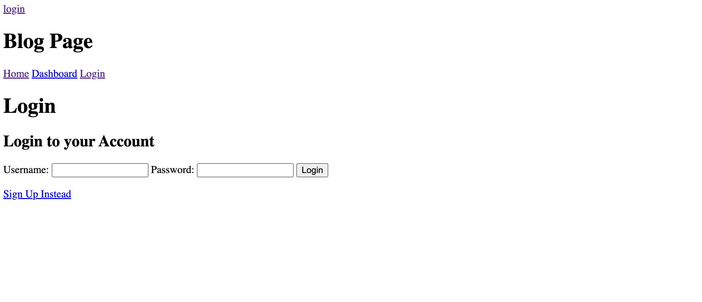

# Model-View-Controller Tech Blog

## Description

The MVC Tech Blog allows users to share their thoughts by posting blogs and interacting with other users by leaving comments on their posts. In order to create a post, users are prompted to sign up. After creating a post, the post is saved to the Dashboard. Users can view their previous posts there. In addition, users are able to log out of the blog site.

## Installation

Users can clone the GitHub repository

The deployed Heroku application: [Tech Blog](https://tranquil-eyrie-28464-2fbd78770fe5.herokuapp.com/home)

## Credits

The TA Ethan was able to help me render the homepage to the screen. He noticed that my app.use(routes) was commented out in my server.js file on line 42. He also noticed that when 'user' was used it did not match the model name 'User'. This correction can be found in homePage.js in the controllers file.

## License

An MIT License has been applied to this project.